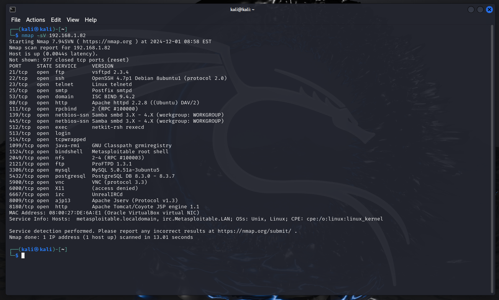
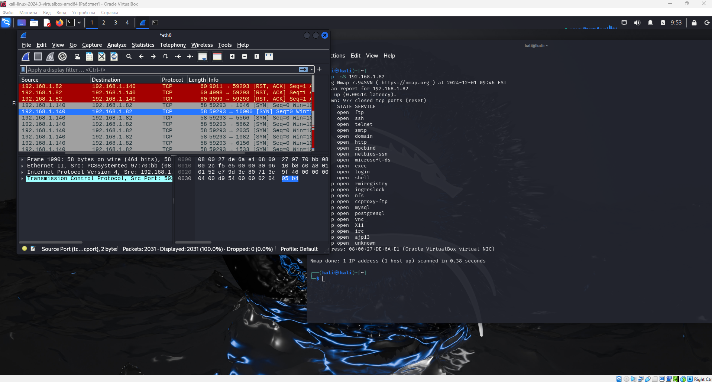
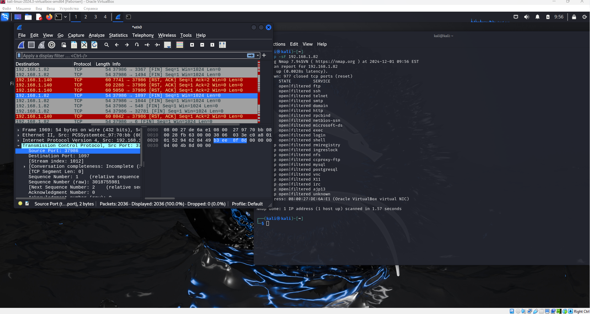
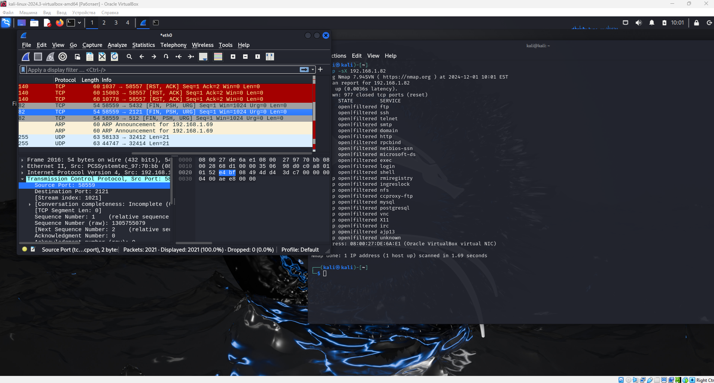
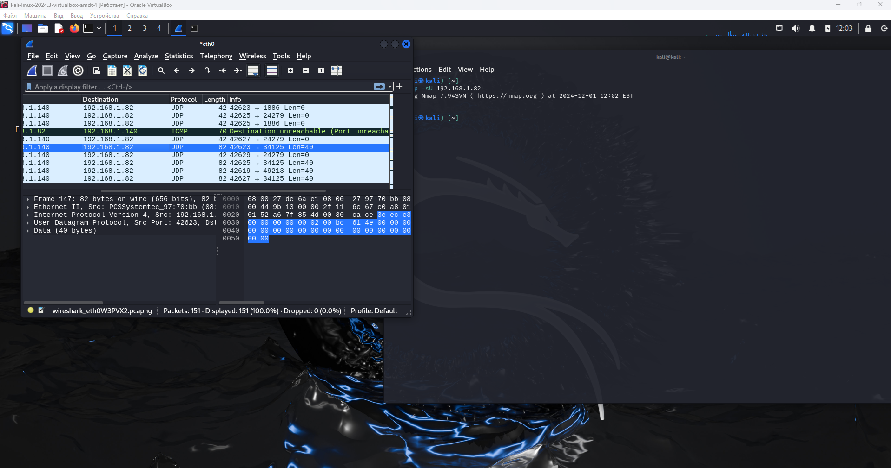

# Домашнее задание к занятию "`Уязвимости и атаки на информационные системы`" - `Дедюрин Денис`

---
## Задание 1
Скачайте и установите виртуальную машину Metasploitable: https://sourceforge.net/projects/metasploitable/.

Это типовая ОС для экспериментов в области информационной безопасности, с которой следует начать при анализе уязвимостей.

Просканируйте эту виртуальную машину, используя nmap.

Попробуйте найти уязвимости, которым подвержена эта виртуальная машина.

Сами уязвимости можно поискать на сайте https://www.exploit-db.com/.

Для этого нужно в поиске ввести название сетевой службы, обнаруженной на атакуемой машине, и выбрать подходящие по версии уязвимости.

Ответьте на следующие вопросы:

Какие сетевые службы в ней разрешены?

Какие уязвимости были вами обнаружены? (список со ссылками: достаточно трёх уязвимостей)

Приведите ответ в свободной форме.

### Ответ:

Для выполнения заданий были использованы 2 ВМ:

Машина "разведчик" с установленной ОС Kali-Linux 2024.3 (192.168.1.140)

Машина "жертва" (Metasploitable) с ОС полной неожиданностей и уязвимостей (192.168.1.82)


После скачивания, установки и запуска ВМ жертвы, производим сканирование уязвимостей с ВМ разведчика:
```
sudo nmap -sV 192.168.1.82
```



Какие сетевые службы в ней разрешены?

Из вывода nmap видно, что на машине **Metasploitable** открыты следующие порты и службы:
```
FTP (vsftpd 2.3.4) - Порт 21
SSH (OpenSSH 4.7p1 Debian 8ubuntu1) - Порт 22
Telnet (Linux telnetd) - Порт 23
SMTP (Postfix smtpd) - Порт 25
DNS (BIND 9.4.2) - Порт 53
HTTP (Apache httpd 2.2.8) - Порт 80
RPCbind - Порт 111
Samba ( 3.X - 4.X) - Порты 139, 445
Netkit rsh rexecd - Порт 512
Login (OpenBSD or Solaris rlogind) - Порт 513
TCPwrapped - Порт 514
Java RMI (GNU Classpath grmiregistry) - Порт 1099
Bindshell (Metasploitable root shell) - Порт 1524
NFS (RPC 2-4) - Порт 2049
FTP (ProFTPD 1.3.1) - Порт 2121
MySQL (MySQL 5.0.51a-3ubuntu5) - Порт 3306
PostgreSQL (PostgreSQL DB 8.3.0 - 8.3.7) - Порт 5432
VNC (protocol 3.3) - Порт 5900
X11 - Порт 6000
IRC (UnrealIRCd) - Порт 6667
Apache Jserv (AJP13) - Порт 8009
Apache Tomcat (Coyote JSP engine 1.1) - Порт 8180
```
Какие уязвимости были вами обнаружены? (список со ссылками: достаточно трёх уязвимостей)

vsftpd 2.3.4  https://www.exploit-db.com/exploits/17491

UnrealIRCd 3.2.8.1 https://www.exploit-db.com/exploits/16922

BIND 9.4.1 < 9.4.2 https://www.exploit-db.com/exploits/6122

---
## Задание 2
Проведите сканирование Metasploitable в режимах SYN, FIN, Xmas, UDP.

Запишите сеансы сканирования в Wireshark.

Ответьте на следующие вопросы:

Чем отличаются эти режимы сканирования с точки зрения сетевого трафика?

Как отвечает сервер?

Приведите ответ в свободной форме.

### Ответ:

Для выполнения задания, будем выполнять последовательно команды. При каждом запуске команды **nmap** параллельно запускаем **Wireshark**.

#### SYN-сканирование
SYN scan: Сканирование SYN отправляет SYN-пакеты на порты, что позволяет определить, какие порты открыты.
```
nmap -sS 192.168.1.82
```


#### FIN-сканирование
FIN scan: FIN-сканирование отправляет пакеты с флагом FIN. Это не завершает соединение и может обойти некоторые системы обнаружения.
```
nmap -sF 192.168.1.82
```


#### Xmas-сканирование
Xmas scan: Xmas-сканирование отправляет пакеты с флагами FIN, PSH и URG. Это позволяет скрыть сканирование от некоторых систем.
```
nmap -sX 192.168.1.82
```


#### UDP-сканирование
UDP scan: UDP-сканирование используется для проверки доступности UDP-портов.
```
nmap -sU 192.168.1.82
```



